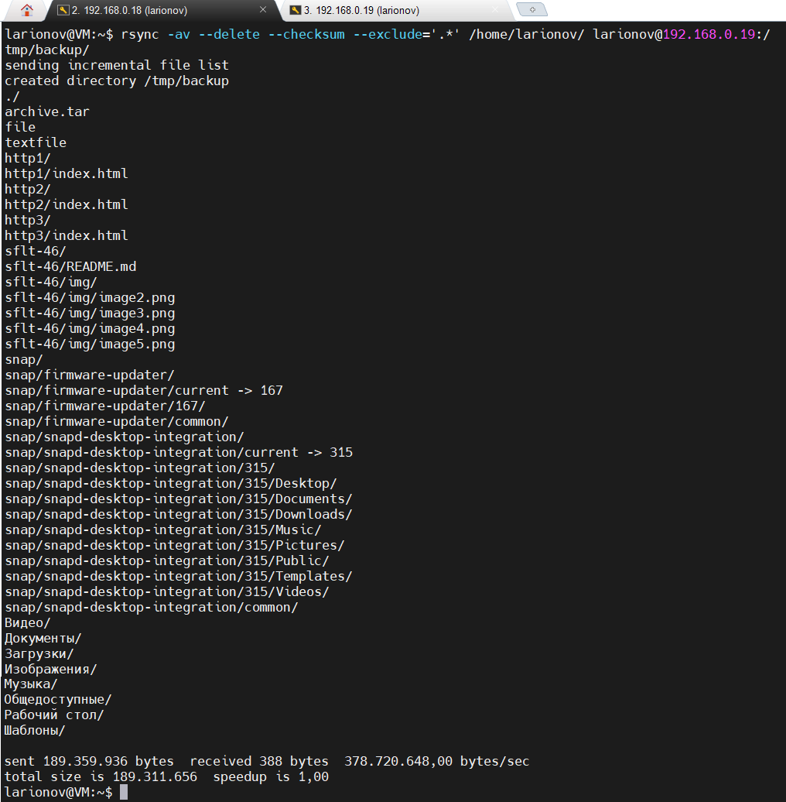
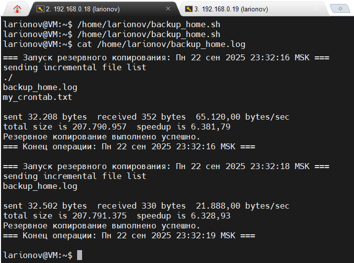

# Домашнее задание к занятию "Резервное копирование"

**SFLT-46 / Ларионов Сергей**

---

### Задание 1: Создание зеркальной копии домашней директории с исключением скрытых каталогов и проверкой контрольных сумм с помощью rsync

Создаём команду

```bash
rsync -av --delete --checksum --exclude='.*' /home/larionov/ larionov@192.168.0.19:/tmp/backup/
```
-a — архивный режим (копирование с сохранением прав, даты, симв. ссылок и т.п.)
-v — подробный вывод
--delete — удаление файлов в приёмнике, которых нет в источнике (зеркальное копирование)
--checksum — проверка файлов по контрольным суммам, а не только по времени и размеру
--exclude='.*' — исключение всех скрытых файлов и директорий (начинающихся с точки)

#### Результат выполнения:


Скриншот: Вывод rsync с перечислением файлов.

В выводе видно, что создаётся директория /tmp/backup на удалённом сервере и копируются только видимые (не скрытые) файлы и папки.

Проверка содержимого на удалённом сервере 192.168.0.19 в /tmp/backup содержатся скопированные файлы и папки без скрытых директорий.


Скриншот: «Проверка содержимого на удалённом сервере».

---

## Задание 2: Автоматизация зеркального резервного копирования домашней директории с помощью скрипта rsync и планировщика cron с логированием результата

#### Написание скрипта backup_home.sh

```bash
#!/bin/bash

LOGFILE="/home/larionov/backup_home.log"
SRC="/home/larionov/"
DEST="larionov@192.168.0.19:/tmp/backup/"

echo "=== Запуск резервного копирования: $(date) ===" >> "$LOGFILE"

rsync -av --delete --checksum "$SRC" "$DEST" >> "$LOGFILE" 2>&1
RSYNC_EXIT_CODE=$?

if [ $RSYNC_EXIT_CODE -eq 0 ]; then
    echo "Резервное копирование выполнено успешно." >> "$LOGFILE"
else
    echo "Ошибка при резервном копировании, код выхода: $RSYNC_EXIT_CODE" >> "$LOGFILE"
fi

echo "=== Конец операции: $(date) ===" >> "$LOGFILE"
echo "" >> "$LOGFILE"
    
```

Скрипт запускает rsync:
Вся информация о работе записывается в лог-файл /home/larionov/backup_home.log.

#### Результат запуска 


Скриншот: Вывод/статус операции запуска.

#### Настройка cron:

Добавлена задача в crontab для запуска скрипта ежедневно — каждый час

```bash
0 * * * * /home/larionov/backup_home.sh
```

#### Ссылка на файл в Google Docs
[Файл crontab](https://drive.google.com/file/d/12TnnngdoKZWXx1ebO-WtYdoHJmsFq5Hx/view?usp=drive_link)

---
